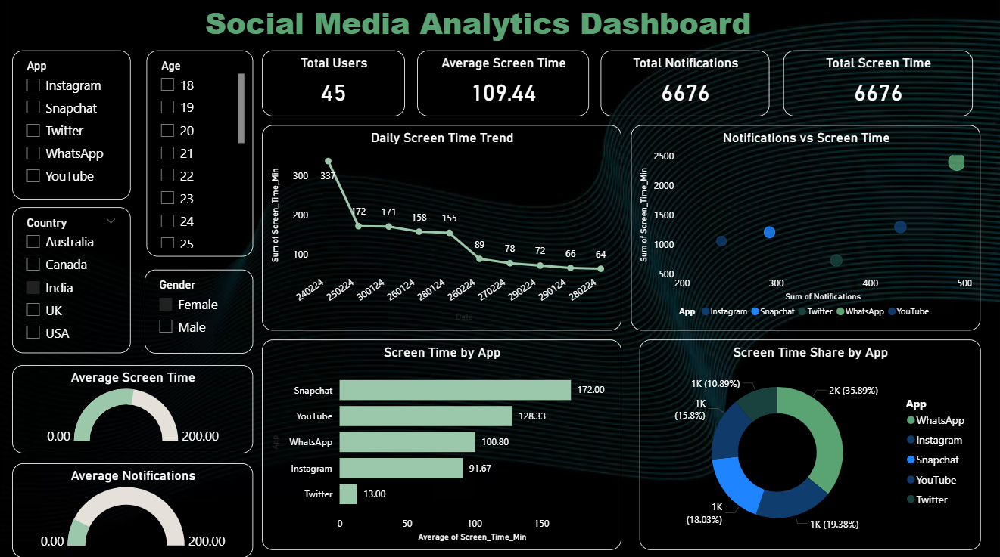

# 📱 Social Media Screen Time Analysis

## ☕ The Idea Behind This Project

Ever wondered **where all our time goes on our phones?**

One moment you're checking a message…
Next thing you know, **45 minutes disappeared into Instagram reels, YouTube videos, or endless scrolling.**

This project explores that exact question.

Using real screen time data, I analyzed **how users spend time across different social media apps** and turned those patterns into insights using **Python, SQL, and Power BI**.

Think of it as **turning digital habits into data stories.**

# 🛠 Tools Used

This project combines multiple data analytics tools:

* **Python (Pandas)** → Data cleaning and preprocessing
* **SQL** → Querying and analyzing the dataset
* **Power BI** → Building the interactive dashboard
* **Jupyter Notebook** → Exploratory data analysis

## 📊 Dashboard Preview

# 📈 What This Project Explores

The analysis focuses on understanding **modern digital behavior**:

📊 Which apps take the most screen time
📊 Daily usage patterns across platforms
📊 Engagement differences between apps
📊 How screen time is distributed across social media

The Power BI dashboard allows users to **visually explore these patterns and trends**.

# 💡 Why This Project Matters

In today's world, **screen time is basically part of our lifestyle**.

Understanding usage patterns can help:

* Identify digital habits
* Compare app engagement
* Explore behavioral trends in social media usage
* Turn everyday data into meaningful insights

# 🚀 Skills Demonstrated

Through this project I practiced key **data analytics skills**:

* Data Cleaning
* SQL Query Writing
* Exploratory Data Analysis
* Data Visualization
* Dashboard Design
* Insight Generation

# 👩‍💻 Author

**Shruti Upadhyay**

Data Analytics Enthusiast | Python • SQL • Power BI
